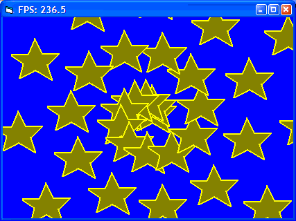



## run\-length blits \(update 4\)

### Description

The Ferrari of blit routines ..

(update 4) better comments, more simplification + 1 type var rename
 
### More Info
 

             |
---                |---
**Submitted On**   |2006-08-16 23:03:48
**By**             |[dafhi](https://github.com/Planet-Source-Code/PSCIndex/blob/master/ByAuthor/dafhi.md)
**Level**          |Intermediate
**User Rating**    |5.0 (30 globes from 6 users)
**Compatibility**  |VB 6\.0
**Category**       |[Graphics](https://github.com/Planet-Source-Code/PSCIndex/blob/master/ByCategory/graphics__1-46.md)
**World**          |[Visual Basic](https://github.com/Planet-Source-Code/PSCIndex/blob/master/ByWorld/visual-basic.md)
**Archive File**   |[run\-length2014018172006\.zip](https://github.com/Planet-Source-Code/dafhi-run-length-blits-update-4__1-66241/archive/master.zip)

